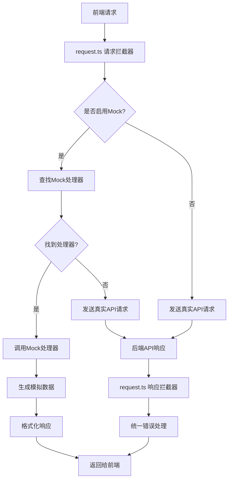

# Mock 数据实现原理与规范文档

## 目录

- [Mock 数据实现原理与规范文档](#mock-数据实现原理与规范文档)
  - [目录](#目录)
  - [实现原理](#实现原理)
    - [整体架构](#整体架构)
    - [拦截机制](#拦截机制)
    - [数据流程](#数据流程)
    - [与 request.ts 的配合机制](#与-requestts-的配合机制)
      - [1. 环境配置控制](#1-环境配置控制)
      - [2. 请求拦截器逻辑](#2-请求拦截器逻辑)
      - [3. 响应拦截器统一处理](#3-响应拦截器统一处理)
      - [4. Mock 处理器注册](#4-mock-处理器注册)
      - [5. 使用方式](#5-使用方式)
  - [基础规范](#基础规范)
    - [文件结构](#文件结构)
    - [命名规范](#命名规范)
  - [响应格式](#响应格式)
    - [基础响应格式](#基础响应格式)
    - [分页查询格式](#分页查询格式)
  - [Mock 数据编写规范](#mock-数据编写规范)
    - [数据定义](#数据定义)
    - [接口实现](#接口实现)
  - [工具函数使用](#工具函数使用)
    - [核心工具函数](#核心工具函数)
    - [错误码常量](#错误码常量)
  - [项目实践](#项目实践)
    - [现有模块](#现有模块)
    - [最佳实践](#最佳实践)
    - [注意事项](#注意事项)

## 实现原理

### 整体架构

本项目采用基于 Vite 的 Mock 拦截方案，通过 `vite-plugin-mock` 插件实现：

```typescript
// vite.config.ts 配置
import { viteMockServe } from 'vite-plugin-mock'

export default defineConfig({
  plugins: [
    viteMockServe({
      mockPath: 'src/mock',
      localEnabled: command === 'serve',
      prodEnabled: false,
      injectCode: `
        import { setupProdMockServer } from './mock/mockProdServer';
        setupProdMockServer();
      `,
    })
  ]
})
```

**核心组件：**
- `src/mock/index.ts` - Mock 入口文件，自动注册所有处理器
- `src/mock/utils.ts` - 工具函数和错误码定义
- `src/mock/[module].ts` - 各模块的 Mock 数据文件

### 拦截机制

1. **请求拦截**：
   - 通过 `vite-plugin-mock` 拦截 HTTP 请求
   - 匹配 URL 路径和请求方法
   - 调用对应的 Mock 处理器

2. **响应处理**：
   - 统一使用 `createMockResponse` 格式化响应
   - 支持分页、错误处理等场景
   - 返回符合后端 API 格式的数据

3. **数据模拟**：
   - 使用 `utils.ts` 中的工具函数生成模拟数据
   - 支持随机数据、分页、过滤等功能
   - 保持数据结构的一致性

### 数据流程



**详细流程：**
1. 前端发起 API 请求（如 `http.get('/note/list')`）
2. `request.ts` 请求拦截器检查环境配置
3. 如果启用 Mock，查找匹配的处理器
4. 找到处理器则调用 Mock 函数生成数据
5. 未找到处理器或未启用 Mock 则发送真实请求
6. 响应拦截器统一处理成功/错误响应
7. 返回给前端，保持统一的响应格式

### 与 request.ts 的配合机制

#### 1. 环境配置控制

```typescript
// src/config/env.ts
export function getEnvConfig() {
  return {
    apiUrl: 'http://localhost:8080',
    useMock: import.meta.env.VITE_USE_MOCK === 'true', // 通过环境变量控制
    // ...其他配置
  }
}
```

#### 2. 请求拦截器逻辑

```typescript
// src/utils/request.ts
request.interceptors.request.use((config) => {
  // 检查是否启用模拟数据
  const useMock = getEnvConfig().useMock

  if (useMock) {
    // 查找匹配的模拟数据处理器
    const match = getMockHandler(config.url)
    if (match) {
      // 使用模拟数据处理器，取消实际请求
      config.adapter = () => {
        return new Promise((resolve) => {
          // 调用处理器获取模拟数据
          Promise.resolve(match.handler({
            data: config.data || {},
            params: { ...config.params, ...match.params } || {},
            headers: config.headers || {}
          }, match.matchedUrl))
            .then((mockData) => {
              resolve({
                data: mockData,
                status: 200,
                statusText: 'OK',
                headers: {},
                config,
              })
            })
        })
      }
    }
  }
  return config
})
```

#### 3. 响应拦截器统一处理

```typescript
// src/utils/request.ts
request.interceptors.response.use(
  (response) => {
    const { data: responseData } = response

    // 判断响应是否成功
    if (responseData && responseData.code === 200) {
      // 直接返回完整的响应数据，保持 {code, msg, data/rows, total} 结构
      return responseData
    }

    // 处理业务错误
    const errorMsg = responseData.msg || '请求失败'

    switch (responseData.code) {
      case 401:
        // token 过期处理
        break
      case 403:
        // 权限不足处理
        break
      // ...其他错误码处理
    }

    return Promise.reject(new Error(errorMsg))
  },
  (error) => {
    // 处理网络错误
    uni.showToast({
      title: error.message || '网络异常',
      icon: 'none',
    })
    return Promise.reject(error)
  }
)
```

#### 4. Mock 处理器注册

```typescript
// src/mock/index.ts
import { registerMockHandler } from '@/utils/request'
import noteMock from './note'
import userMock from './user'
// ...其他模块

// 注册所有 Mock 处理器
export function setupMockHandlers() {
  // 注册笔记相关接口
  noteMock.forEach(({ url, response }) => {
    registerMockHandler(url, response)
  })

  // 注册用户相关接口
  userMock.forEach(({ url, response }) => {
    registerMockHandler(url, response)
  })

  // ...注册其他模块
}

// 在应用启动时调用
setupMockHandlers()
```

#### 5. 使用方式

```typescript
// 前端调用方式（Mock 和真实 API 完全一致）
import { http } from '@/utils/request'

// 获取笔记列表
const getNoteList = async (params: any) => {
  try {
    const response = await http.get('/note/list', params)
    return response // 已经是 {code, msg, data/rows, total} 格式
  } catch (error) {
    console.error('获取笔记列表失败:', error)
    throw error
  }
}

// 创建笔记
const createNote = async (data: any) => {
  try {
    const response = await http.post('/note/create', data)
    return response
  } catch (error) {
    console.error('创建笔记失败:', error)
    throw error
  }
}
```

## 基础规范

### 文件结构

```bash
src/mock/
  ├── index.ts          # Mock 入口文件，自动注册所有处理器
  ├── utils.ts          # 工具函数和错误码定义
  ├── user.ts           # 用户相关 (25KB, 1116行)
  ├── note.ts           # 笔记相关 (27KB, 988行)
  ├── goods.ts          # 商品相关 (12KB, 381行)
  ├── fun.ts            # 好玩活动 (18KB, 508行)
  ├── merchant.ts       # 商家相关 (22KB, 813行)
  ├── funOrder.ts       # 好玩订单 (21KB, 772行)
  ├── member.ts         # 会员相关 (13KB, 572行)
  ├── city.ts           # 城市数据 (11KB, 614行)
  ├── banners.ts        # 轮播图 (4.1KB, 186行)
  ├── poster.ts         # 海报相关 (7.2KB, 336行)
  ├── dict.ts           # 字典数据 (2.0KB, 93行)
  ├── qrcode.ts         # 二维码 (1.4KB, 58行)
  └── README.md         # Mock 说明文档
```

### 命名规范

1. **文件命名**：
   - 使用小写字母
   - 使用连字符分隔单词
   - 例如：`user-profile.ts`、`fun-order.ts`

2. **变量命名**：
   - Mock 数据变量前缀使用 `mock`
   - 例如：`mockUserList`、`mockCategories`、`mockNoteList`

3. **函数命名**：
   - Mock 处理函数前缀使用 `mock`
   - 动词 + 模块名 + 操作
   - 例如：`mockGetUserProfile`、`mockUpdateUserInfo`、`mockGetNoteList`

## 响应格式

### 基础响应格式

使用 `createMockResponse` 函数统一响应格式：

```typescript
// 成功响应
return createMockResponse({
  // 响应数据
})

// 响应格式
{
  code: 200,         // 状态码
  msg: 'success',    // 消息提示
  data: any          // 响应数据
}
```

### 分页查询格式

分页接口必须包含以下参数：

```typescript
// 请求参数
interface PageParams {
  pageNum: number      // 当前页码
  pageSize: number     // 每页条数
  orderByColumn?: string  // 排序字段
  isAsc?: 'asc' | 'desc' // 排序方式
}

// 分页响应格式
return createMockResponse({
  rows: [],           // 数据列表
  total: 100         // 总条数
})
```

## Mock 数据编写规范

### 数据定义

1. **类型定义**：
```typescript
// 使用 TypeScript 接口定义数据结构
import type { INote, ILocation, IProduct, INoteMerchant, IFun } from '@/types/interfaces/note'

// 定义 Mock 数据
const mockNotes: INote[] = [
  {
    id: 'note_001',
    title: '今晚的酒吧太棒了！',
    content: '和朋友来到这家酒吧，音乐很棒，服务很好，强烈推荐！',
    images: ['/profile/upload/100x100.jpg'],
    userId: 1,
    likeCount: 120,
    commentCount: 15,
    // ...其他字段
  }
]
```

2. **数据规范**：
   - 使用真实的数据结构
   - 提供足够的测试数据（建议 8-12 条）
   - 包含各种边界情况
   - 使用有意义的示例数据
   - 图片地址使用 `$getImageUrl()` 处理

### 接口实现

1. **基础格式**：
```typescript
import type { MockHandler } from '@/types/interfaces/mock'
import { createMockResponse, MockErrorCode } from './utils'

// 导出默认数组
export default [
  {
    url: '/api/notes/list',
    response: ({ query }) => {
      return mockGetNoteList(query)
    }
  }
] as MockHandler[]
```

2. **处理函数**：
```typescript
function mockGetNoteList(params: any) {
  // 1. 参数处理
  const { keyword, status, pageNum = 1, pageSize = 10 } = params

  // 2. 数据过滤
  let result = [...mockNotes]
  if (keyword) {
    result = result.filter(item =>
      item.title.includes(keyword) || item.content.includes(keyword)
    )
  }

  // 3. 分页处理
  const total = result.length
  const start = (pageNum - 1) * pageSize
  const end = start + pageSize
  const rows = result.slice(start, end)

  // 4. 返回结果
  return createMockResponse({
    rows,
    total
  })
}
```

## 工具函数使用

### 核心工具函数

1. **`createMockResponse`**：创建标准响应
```typescript
// 成功响应
createMockResponse(data)

// 分页响应
createMockResponse({
  rows: list,
  total: total
})
```

2. **`createMockError`**：创建错误响应
```typescript
// 参数错误
createMockError(MockErrorCode.BAD_REQUEST, '参数错误')

// 未授权
createMockError(MockErrorCode.UNAUTHORIZED, '未登录或登录已过期')
```

3. **数据生成工具**：
```typescript
// 随机整数
randomInt(1, 100)

// 随机日期
randomDate()

// 随机图片
getRandomImage('note')

// 生成随机ID
generateRandomId()
```

### 错误码常量

```typescript
export const MockErrorCode = {
  SUCCESS: 200,      // 操作成功
  CREATED: 201,      // 创建成功
  BAD_REQUEST: 400,  // 参数错误
  UNAUTHORIZED: 401, // 未授权
  FORBIDDEN: 403,    // 权限不足
  NOT_FOUND: 404,    // 资源不存在
  SERVER_ERROR: 500  // 服务器错误
} as const
```

## 项目实践

### 现有模块

本项目已实现的 Mock 模块：

1. **用户模块** (`user.ts`)
   - 用户信息、登录注册、个人资料
   - 1116 行代码，25KB 大小

2. **笔记模块** (`note.ts`)
   - 笔记列表、详情、评论、点赞
   - 988 行代码，27KB 大小

3. **商品模块** (`goods.ts`)
   - 商品列表、详情、分类、标签
   - 381 行代码，12KB 大小

4. **好玩活动模块** (`fun.ts`)
   - 活动列表、详情、订单、核销
   - 508 行代码，18KB 大小

5. **商家模块** (`merchant.ts`)
   - 商家信息、评论、分类
   - 813 行代码，22KB 大小

### 最佳实践

1. **数据生成**：
```typescript
// 使用工具函数生成真实数据
export function generateMockNote(id?: string): INote {
  const titles = [
    '今晚的酒吧太棒了！',
    '和朋友一起享受美好夜晚',
    '这家live house的氛围绝了'
  ]

  const randomIndex = Math.floor(Math.random() * titles.length)

  return {
    id: id || randomInt(1, 10000),
    title: titles[randomIndex],
    content: '详细内容...',
    images: Array.from({ length: Math.floor(Math.random() * 4) + 1 }, () => getRandomImage('note')),
    userId: randomInt(1, 3), // 使用 1、2、3 轮流
    likeCount: Math.floor(Math.random() * 1000) + 10,
    commentCount: Math.floor(Math.random() * 100) + 5,
    // ...其他字段
  }
}
```

2. **分页处理**：
```typescript
export function generateMockNoteList(pageNum: number = 1, pageSize: number = 10): {
  rows: INote[]
  total: number
} {
  const total = 50 // 总共50条数据
  const start = (pageNum - 1) * pageSize
  const actualSize = Math.min(pageSize, total - start)

  const rows = Array.from({ length: Math.max(0, actualSize) }, (_, index) => {
    return generateMockNote(`note_${pageNum}_${index + 1}`)
  })

  return {
    rows,
    total
  }
}
```

3. **接口实现**：
```typescript
function mockGetNoteList(params: IPageParams & {
  category?: string
  authorId?: string
  recommendType?: 'latest' | 'hotBar' | 'groupBuy'
  keyword?: string
}) {
  const { pageNum = 1, pageSize = 10, keyword } = params

  // 生成模拟数据
  const result = generateMockNoteList(pageNum, pageSize)

  // 关键词过滤
  if (keyword) {
    result.rows = result.rows.filter(note =>
      note.title.includes(keyword) || note.content.includes(keyword)
    )
  }

  return createMockResponse(result)
}
```

4. **错误处理**：
```typescript
function mockGetNoteDetail({ params }: any) {
  const { id } = params

  if (!id) {
    return createMockError(MockErrorCode.BAD_REQUEST, '笔记ID不能为空')
  }

  const note = mockNotes.find(n => n.id === id)
  if (!note) {
    return createMockError(MockErrorCode.NOT_FOUND, '笔记不存在')
  }

  return createMockResponse(note)
}
```

### 注意事项

1. **保持一致性**：
   - 与后端 API 响应格式保持一致
   - 数据结构与 TypeScript 接口定义一致
   - 错误码与后端保持一致
   - Mock 响应格式必须符合 `request.ts` 的期望格式

2. **数据质量**：
   - 提供真实有意义的示例数据
   - 包含各种边界情况和异常场景
   - 确保数据的完整性和准确性
   - 模拟数据要能通过 `request.ts` 的响应拦截器验证

3. **性能考虑**：
   - 避免生成过多无用数据
   - 合理使用分页机制
   - 优化数据生成算法
   - Mock 处理器执行时间要控制在合理范围内

4. **维护性**：
   - 及时更新 Mock 数据与接口文档同步
   - 保持代码的可读性和可维护性
   - 添加必要的注释和说明
   - 确保 Mock 处理器与 `request.ts` 的兼容性

5. **开发流程**：
   - 先定义接口和数据结构
   - 编写 Mock 数据和处理器
   - 测试接口的完整性和正确性
   - 更新相关文档

6. **与 request.ts 配合**：
   - Mock 处理器必须返回符合 `{code, msg, data/rows, total}` 格式的数据
   - 错误响应要使用标准的错误码（401、403、404、500等）
   - 确保 Mock 数据能通过响应拦截器的验证
   - 测试 Mock 和真实 API 的切换是否正常
   - 验证错误处理机制在 Mock 模式下是否正常工作

7. **环境配置**：
   - 通过环境变量 `VITE_USE_MOCK` 控制是否启用 Mock
   - 开发环境默认启用 Mock，生产环境禁用
   - 确保 Mock 处理器注册在应用启动时完成
   - 测试不同环境下的行为一致性
