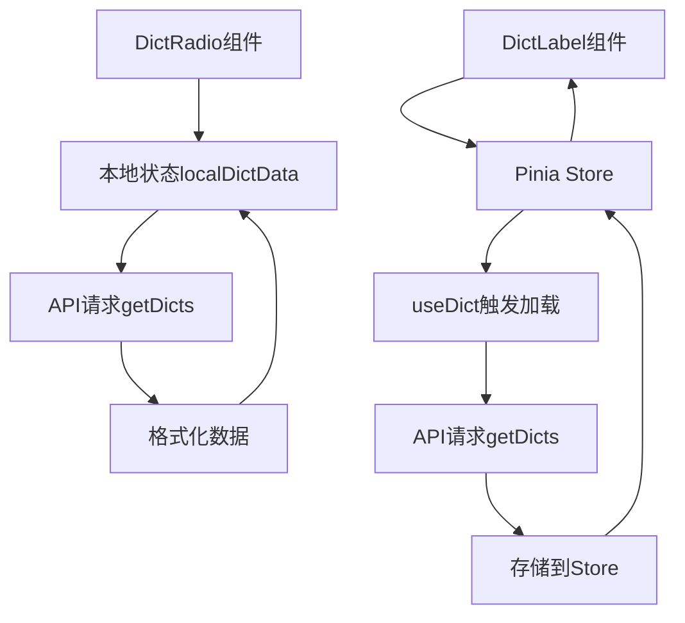

# 字典组件实现文档

## 概述

本文档详细介绍了项目中两个核心字典组件的实现原理和使用方法：`DictRadio`（字典单选组件）和 `DictLabel`（字典标签组件）。这两个组件基于 uView Plus 和 Pinia 状态管理，为项目提供了统一的字典数据展示和选择功能。

## 组件架构

### 技术栈
- **框架**: UniApp + Vue3 + TypeScript
- **UI库**: uView Plus
- **状态管理**: Pinia
- **网络请求**: @/utils/request

### 组件关系
```
DictRadio (字典单选组件)
├── 使用本地状态管理字典数据
├── 基于 uView Plus up-radio-group
└── 支持水平/垂直布局

DictLabel (字典标签组件)
├── 使用 Pinia 全局状态管理
├── 基于 view 标签显示
└── 支持小程序兼容性
```

## DictRadio 组件详解

### 功能特性
- 基于字典数据的单选组件
- 支持水平/垂直布局方向
- 支持禁用状态
- 支持自定义样式类
- 自动获取和缓存字典数据

### 组件属性

| 属性名 | 类型 | 默认值 | 必填 | 说明 |
|--------|------|--------|------|------|
| dictName | String | - | 是 | 字典名称，用于获取对应的字典数据 |
| modelValue | String/Number | '' | 否 | 绑定的值，支持 v-model |
| direction | String | 'horizontal' | 否 | 布局方向：'horizontal'（水平）或 'vertical'（垂直） |
| disabled | Boolean | false | 否 | 是否禁用组件 |
| customClass | String | '' | 否 | 自定义样式类名 |

### 事件

| 事件名 | 参数 | 说明 |
|--------|------|------|
| update:modelValue | value | 值变化时触发，支持 v-model |
| change | value | 选择项变化时触发 |

### 核心实现逻辑

#### 1. 数据获取机制
```typescript
// 使用本地状态管理字典数据，不依赖全局缓存
const localDictData = ref([])

// 确保字典数据已加载
const ensureDictLoaded = async (dictType) => {
  try {
    const resp = await getDicts(dictType)
    if (resp && resp.code === 200 && Array.isArray(resp.rows)) {
      // 格式化字典数据
      const formatted = resp.rows.map((item) => ({
        label: item.dictLabel,
        value: item.dictValue,
        elTagType: item.listClass,
        elTagClass: item.cssClass,
        listClass: item.listClass,
        cssClass: item.cssClass
      }))
      localDictData.value = formatted
    }
  } catch (e) {
    localDictData.value = []
  }
}
```

#### 2. 双向绑定实现
```typescript
// 内部绑定值
const innerValue = ref(props.modelValue)

// 父 -> 子 同步
watch(() => props.modelValue, (val) => {
  innerValue.value = val
})

// 子 -> 父 同步
const onGroupChange = (value) => {
  emit('update:modelValue', value)
  emit('change', value)
}
```

#### 3. 字典数据监听
```typescript
// 监听字典名称变化，重新获取数据
watch(
  () => props.dictName,
  async (newDictName) => {
    if (newDictName) {
      localDictData.value = []
      await ensureDictLoaded(newDictName)
    }
  },
  { immediate: true }
)
```

### 使用示例

```vue
<template>
  <view>
    <!-- 基础用法 -->
    <DictRadio
      v-model="selectedValue"
      dict-name="user_status"
      @change="handleChange"
    />

    <!-- 垂直布局 -->
    <DictRadio
      v-model="selectedValue"
      dict-name="user_status"
      direction="vertical"
      custom-class="my-radio"
    />

    <!-- 禁用状态 -->
    <DictRadio
      v-model="selectedValue"
      dict-name="user_status"
      :disabled="true"
    />
  </view>
</template>

<script setup>
import { ref } from 'vue'
import DictRadio from '@/components/DictRadio/index.vue'

const selectedValue = ref('')

const handleChange = (value) => {
  console.log('选择的值:', value)
}
</script>
```

## DictLabel 组件详解

### 功能特性
- 基于字典值显示对应的标签文本
- 使用 Pinia 全局状态管理
- 支持小程序兼容性
- 自动触发字典数据加载

### 组件属性

| 属性名 | 类型 | 默认值 | 必填 | 说明 |
|--------|------|--------|------|------|
| type | String | - | 是 | 字典类型，用于获取对应的字典数据 |
| value | String | - | 是 | 字典值，用于匹配对应的标签 |

### 核心实现逻辑

#### 1. 字典数据获取
```typescript
// 通过全局useDict触发加载，避免刷新首次为空
const { proxy } = getCurrentInstance() as any
if (props.type && proxy?.useDict) {
  proxy.useDict(props.type)
}
```

#### 2. 标签文本计算
```typescript
const dictStore = useDictStore()
const labelText = computed(() => {
  if (!props.type) return props.value || ''

  // 优先从Pinia缓存获取
  const cached = dictStore.getDict(props.type) as any[] | undefined
  const list = Array.isArray(cached) ? cached : []

  // 查找匹配的字典项
  const hit = list.find(it => (it.value ?? it.dictValue) === props.value)

  // 返回标签文本或原始值
  return hit ? (hit.label ?? hit.dictLabel) : (props.value || '')
})
```

#### 3. 响应式更新
```typescript
// 监听字典数据变化，确保在小程序中正确更新显示
watch(() => dictStore.dict, () => {
  // 强制触发重新计算
}, { deep: true })
```

### 使用示例

```vue
<template>
  <view>
    <!-- 基础用法 -->
    <DictLabel type="user_status" value="1" />

    <!-- 在列表中使用 -->
    <view v-for="user in userList" :key="user.id">
      <text>用户状态：</text>
      <DictLabel type="user_status" :value="user.status" />
    </view>
  </view>
</template>

<script setup>
import DictLabel from '@/components/DictLabel.vue'

const userList = ref([
  { id: 1, status: '1' },
  { id: 2, status: '2' }
])
</script>
```

## 设计模式分析

### 1. 状态管理策略

#### DictRadio 组件
- **本地状态管理**: 使用 `ref` 管理字典数据，避免全局状态污染
- **按需加载**: 只在组件需要时加载字典数据
- **独立缓存**: 每个组件实例维护自己的字典数据缓存

#### DictLabel 组件
- **全局状态管理**: 使用 Pinia store 管理字典数据
- **共享缓存**: 多个组件实例共享同一份字典数据
- **自动加载**: 通过 `useDict` 自动触发字典数据加载

### 2. 数据流设计



### 3. 兼容性处理

#### 小程序兼容性
```vue
<!-- DictLabel 使用 view 替代 text，提高小程序兼容性 -->
<view class="dict-label">{{ labelText }}</view>
```

#### 数据格式兼容
```typescript
// 支持多种数据格式
const hit = list.find(it => (it.value ?? it.dictValue) === props.value)
return hit ? (hit.label ?? hit.dictLabel) : (props.value || '')
```

## 性能优化

### 1. 数据缓存策略
- **DictRadio**: 组件级缓存，避免重复请求
- **DictLabel**: 全局缓存，多组件共享数据

### 2. 响应式优化
- 使用 `computed` 进行标签文本计算
- 使用 `watch` 监听数据变化
- 避免不必要的重新渲染

### 3. 内存管理
- 组件销毁时自动清理本地状态
- 全局状态由 Pinia 统一管理生命周期

## 最佳实践

### 1. 组件选择
- **需要用户交互**: 使用 `DictRadio`
- **仅显示标签**: 使用 `DictLabel`

### 2. 性能考虑
- 大量 `DictLabel` 组件时，优先使用全局缓存
- 少量 `DictRadio` 组件时，可以使用本地状态

### 3. 错误处理
- 组件内部已处理 API 请求异常
- 数据为空时显示原始值
- 支持降级显示

## 扩展建议

### 1. 功能扩展
- 支持多选功能（DictCheckbox）
- 支持搜索过滤
- 支持自定义渲染模板

### 2. 性能优化
- 实现虚拟滚动
- 添加数据预加载
- 优化大数据量渲染

### 3. 开发体验
- 添加 TypeScript 类型定义
- 完善组件文档
- 添加单元测试

## 总结

这两个字典组件通过不同的状态管理策略，为项目提供了灵活、高效的字典数据展示和选择功能。`DictRadio` 适合需要用户交互的场景，而 `DictLabel` 适合纯展示场景。组件设计充分考虑了 UniApp 的特性和小程序的兼容性，为项目的字典功能提供了可靠的基础。
