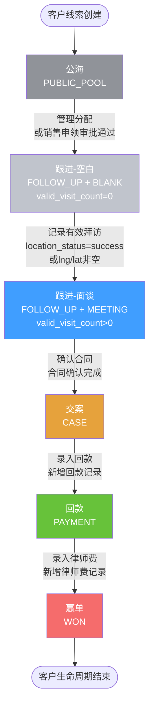
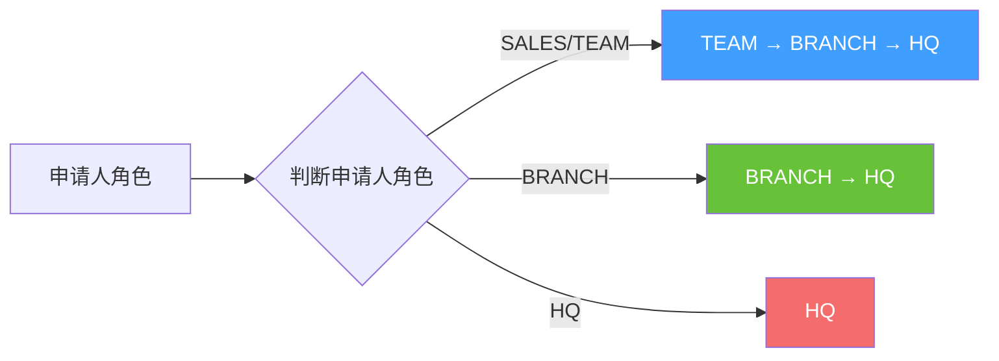

# 系统角色权限与客户状态流转分析

> 本文档详细分析了当前CRM系统中的4种用户角色及其权限，以及客户状态流转的完整流程。

---

## 一、用户角色定义

系统中共有 **4种用户角色**，采用层级化管理：

### 1. 总所管理（HQ - Headquarters）

**角色标识**：`HQ`

**角色特点**：
- 仅管理职能（无销售职能）
- 全所范围管理与审阅
- 具备最高管理权限

**数据范围**：
- 可查看全所所有客户数据
- 可查看全所所有分所、团队、销售人员的数据

**核心权限**：
- ✅ 公海客户分配（可直接分配给任意销售人员）
- ✅ 审批申领申请（审批链最高层级）
- ✅ 审批客户转交申请
- ✅ 审批新增线索申请
- ✅ 查看全所数据报表
- ✅ 团队日程管理（全所范围）
- ✅ 规则配置管理
- ✅ 公海分配管理
- ❌ 不能作为经办人推进客户（无销售职能）

**审批权限**：
- 审批链：`HQ`（单独审批）

---

### 2. 分所管理（BRANCH）

**角色标识**：`BRANCH`

**角色特点**：
- 仅管理职能（无销售职能）
- 本所范围管理与审阅

**数据范围**：
- 可查看本分所所有客户数据
- 可查看本分所所有团队、销售人员的数据

**核心权限**：
- ✅ 公海客户分配（本分所范围内）
- ✅ 审批申领申请（审批链：BRANCH → HQ）
- ✅ 审批客户转交申请（本分所范围内）
- ✅ 审批新增线索申请（本分所范围内）
- ✅ 查看本分所数据报表
- ✅ 团队日程管理（本分所范围）
- ❌ 不能作为经办人推进客户（无销售职能）

**审批权限**：
- 审批链：`BRANCH → HQ`（逐级审批）

---

### 3. 团队管理（TEAM）

**角色标识**：`TEAM`

**角色特点**：
- **双重职能**：管理职能 + 销售职能
- 基层管理 + 也具备销售职能

**数据范围**：
- 可查看本团队所有客户数据
- 可查看本团队所有销售人员的数据
- 可作为经办人推进自己的客户

**核心权限**：
- ✅ 公海客户分配（本团队范围内）
- ✅ 审批申领申请（审批链：TEAM → BRANCH → HQ）
- ✅ 审批客户转交申请（本团队范围内）
- ✅ 审批新增线索申请（本团队范围内）
- ✅ 查看本团队数据报表
- ✅ 团队日程管理（本团队范围）
- ✅ **可作为经办人推进客户**（销售职能）
- ✅ 申领公海客户（需审批）
- ✅ 新增跟进记录
- ✅ 记录拜访
- ✅ 创建跟进计划
- ✅ 确认合同交案
- ✅ 录入回款
- ✅ 录入律师费
- ✅ 申请客户转交

**审批权限**：
- 审批链：`TEAM → BRANCH → HQ`（逐级审批）

---

### 4. 销售（SALES）

**角色标识**：`SALES`

**角色特点**：
- 仅销售职能
- 个人负责客户的执行与录入

**数据范围**：
- 仅可查看本人负责的客户（`owner_user_id = 自己`）
- 可查看可申领范围内的公海客户

**核心权限**：
- ✅ 申领公海客户（需审批，审批链：TEAM → BRANCH → HQ）
- ✅ 新增跟进记录
- ✅ 记录拜访
- ✅ 创建跟进计划
- ✅ 确认合同交案
- ✅ 录入回款
- ✅ 录入律师费
- ✅ 申请客户转交（需审批）
- ✅ 新增自有线索（需审批后进入公海）
- ❌ 不能分配客户给他人
- ❌ 不能审批申请
- ❌ 不能查看他人客户数据（除非转交给自己）

**审批权限**：
- 无审批权限，只能发起申请

---

## 二、角色权限对比表

| 功能权限 | HQ（总所管理） | BRANCH（分所管理） | TEAM（团队管理） | SALES（销售） |
|---------|---------------|------------------|----------------|--------------|
| **数据范围** | 全所 | 本分所 | 本团队 | 本人负责 |
| **公海客户分配** | ✅ 全所 | ✅ 本分所 | ✅ 本团队 | ❌ |
| **申领公海客户** | ❌ | ❌ | ✅（需审批） | ✅（需审批） |
| **新增线索** | ✅ 直接进公海 | ✅ 直接进公海 | ✅ 直接进公海 | ✅ 需审批 |
| **审批申领** | ✅ 最高层级 | ✅ 分所层级 | ✅ 团队层级 | ❌ |
| **审批转交** | ✅ 最高层级 | ✅ 分所层级 | ✅ 团队层级 | ❌ |
| **审批新增线索** | ✅ 最高层级 | ✅ 分所层级 | ✅ 团队层级 | ❌ |
| **作为经办人推进客户** | ❌ | ❌ | ✅ | ✅ |
| **新增跟进记录** | ❌ | ❌ | ✅ | ✅ |
| **记录拜访** | ❌ | ❌ | ✅ | ✅ |
| **创建跟进计划** | ❌ | ❌ | ✅ | ✅ |
| **确认合同交案** | ❌ | ❌ | ✅ | ✅ |
| **录入回款** | ❌ | ❌ | ✅ | ✅ |
| **录入律师费** | ❌ | ❌ | ✅ | ✅ |
| **申请客户转交** | ❌ | ❌ | ✅ | ✅ |
| **查看数据报表** | ✅ 全所 | ✅ 本分所 | ✅ 本团队 | ✅ 个人 |
| **团队日程管理** | ✅ 全所 | ✅ 本分所 | ✅ 本团队 | ❌ |
| **规则配置** | ✅ | ❌ | ❌ | ❌ |

---

## 三、客户状态流转流程

### 3.1 客户生命周期状态（status）

系统定义了 **5个客户生命周期状态**：

1. **PUBLIC_POOL（公海）**：未分配的线索
2. **FOLLOW_UP（跟进）**：已分配给销售，正在跟进中
3. **CASE（交案）**：已签订合同
4. **PAYMENT（回款）**：已有回款记录
5. **WON（赢单）**：已支付律师费

### 3.2 展业状态（sales_stage）

`sales_stage` 是后端计算的派生字段，用于更细粒度跟踪销售进展：

1. **PUBLIC_POOL（公海）**：`status === 'PUBLIC_POOL'`
2. **BLANK（空白）**：`status === 'FOLLOW_UP' && valid_visit_count === 0`
3. **MEETING（面谈）**：`status === 'FOLLOW_UP' && valid_visit_count > 0`
4. **CASE（交案）**：`status === 'CASE'`
5. **PAYMENT（回款）**：`status === 'PAYMENT'`
6. **WON（赢单）**：`status === 'WON'`

**有效拜访判定**：
- `location_status === 'success'`（定位成功）
- **或** `lng` 和 `lat` 字段非空（有坐标信息）

### 3.3 状态流转规则

#### 流转触发条件

| 状态流转 | 触发条件 | 操作角色 |
|---------|---------|---------|
| **公海 → 跟进** | 审批通过 + 分配经办人 | 管理角色（HQ/BRANCH/TEAM）分配，或销售申领后审批通过 |
| **跟进 → 交案** | 合同确认完成 | 经办人（TEAM/SALES） |
| **交案 → 回款** | 新增回款记录 | 经办人（TEAM/SALES） |
| **回款 → 赢单** | 新增律师费记录 | 经办人（TEAM/SALES） |

#### 状态流转流程图



### 3.4 详细状态流转说明

#### ① 公海 → 跟进（空白）

**触发方式**：
1. **管理分配**：HQ/BRANCH/TEAM 直接分配公海客户给销售人员
2. **销售申领**：SALES/TEAM 申领公海客户，经过审批链审批通过

**审批链规则**：
- 申请人是 SALES/TEAM：`TEAM → BRANCH → HQ`（逐级审批）
- 申请人是 BRANCH：`BRANCH → HQ`
- 申请人是 HQ：`HQ`（单独审批）

**状态变化**：
- `status`: `PUBLIC_POOL` → `FOLLOW_UP`
- `sales_stage`: `PUBLIC_POOL` → `BLANK`（因为 `valid_visit_count = 0`）
- `owner_user_id`: 设置为分配的经办人ID

---

#### ② 跟进（空白）→ 跟进（面谈）

**触发方式**：
- 经办人记录有效拜访（`location_status = 'success'` 或 `lng/lat` 非空）

**状态变化**：
- `status`: 保持 `FOLLOW_UP`
- `sales_stage`: `BLANK` → `MEETING`（因为 `valid_visit_count` 从 0 变为 >0）
- `valid_visit_count`: 自动递增

---

#### ③ 跟进 → 交案

**触发方式**：
- 经办人确认合同完成（上传合同附件 + 填写合同信息）

**状态变化**：
- `status`: `FOLLOW_UP` → `CASE`
- `sales_stage`: `MEETING` → `CASE`
- 自动生成最小案件字段

---

#### ④ 交案 → 回款

**触发方式**：
- 经办人录入回款记录（回款时间、金额、催收类别、凭证）

**状态变化**：
- `status`: `CASE` → `PAYMENT`
- `sales_stage`: `CASE` → `PAYMENT`
- 支持多笔回款记录

---

#### ⑤ 回款 → 赢单

**触发方式**：
- 经办人录入律师费记录（支付时间、金额、凭证）

**状态变化**：
- `status`: `PAYMENT` → `WON`
- `sales_stage`: `PAYMENT` → `WON`
- 支持多笔律师费记录

---

## 四、审批流程说明

### 4.1 审批类型

系统支持以下审批类型：

1. **LEAD_CLAIM（申领公海线索）**：销售申领公海客户
2. **LEAD_CREATE（新增线索）**：销售新增自有线索（需审批后进入公海）
3. **HANDOVER（客户转交）**：销售申请将客户转交给其他销售人员

### 4.2 审批链构建规则



**审批链规则**：
- 申请人是 SALES/TEAM：`TEAM → BRANCH → HQ`（逐级审批）
- 申请人是 BRANCH：`BRANCH → HQ`
- 申请人是 HQ：`HQ`（单独审批）
- 若组织缺失某层级审批人，则自动跳过该层，进入上一级

### 4.3 审批结果

**全部层级通过**：
- 申领：分配经办人（默认=申请人）→ `status` 转为 `FOLLOW_UP`
- 新增线索：进入公海（`status = PUBLIC_POOL`）
- 转交：`owner_user_id` 变更 + 生成转交日志

**任一层级驳回**：
- 保持原状态
- 记录 `reject_reason` + 审批历史
- 申请人可重新提交

---

## 五、客户回收风险规则

系统会根据以下规则计算回收风险等级（`recycle_risk_level`）：

1. **领取线索后 1 个月内未形成有效拜访** → 高风险
2. **客户进入跟进状态后 6 个月内未交案** → 中风险
3. **客户赢单后 6 个月内无新合同** → 低风险

**风险等级**：
- `none`：无风险
- `low`：低风险
- `medium`：中风险
- `high`：高风险

后端返回字段：
- `recycle_risk_level`：风险等级
- `recycle_deadline`：回收截止时间

---

## 六、角色权限判断代码示例

### 6.1 角色判断（UserStore）

```typescript
// src/stores/user.ts
const userStore = useUserStore()

// 角色层级判断
userStore.isAdmin        // HQ（总所管理）
userStore.isBranchManager  // BRANCH（分所管理）
userStore.isTeamManager    // TEAM（团队管理）
userStore.isSales          // SALES（销售）或 TEAM（团队管理也有销售职能）
userStore.isManager        // HQ/BRANCH/TEAM（管理角色）
```

### 6.2 权限控制组件

```vue
<!-- 管理角色可见 -->
<PermissionWrapper manager-only>
  <view>管理功能</view>
</PermissionWrapper>

<!-- 销售角色可见 -->
<PermissionWrapper sales-only>
  <view>销售功能</view>
</PermissionWrapper>

<!-- 特定权限可见 -->
<PermissionWrapper permission="client:assign">
  <view>分配客户</view>
</PermissionWrapper>
```

---

## 七、总结

### 7.1 角色层级关系

```
HQ（总所管理）
  └── BRANCH（分所管理）
      └── TEAM（团队管理）
          └── SALES（销售）
```

### 7.2 核心特点

1. **层级化管理**：HQ → BRANCH → TEAM → SALES，逐级管理
2. **双重职能**：TEAM 既有管理职能也有销售职能
3. **审批链**：逐级审批，确保权限与责任链路可追溯
4. **状态流转**：5个生命周期状态 + 6个展业状态，精确跟踪客户进展
5. **数据范围**：按角色层级控制数据可见范围

### 7.3 关键流程

1. **公海线索管理**：管理分配 vs 销售申领（需审批）
2. **客户跟进**：跟进记录 → 有效拜访 → 面谈状态
3. **合同交案**：确认合同 → 状态转交案
4. **回款与赢单**：录入回款 → 录入律师费 → 赢单

---

**文档版本**：v1.0  
**最后更新**：2024-12-25  
**维护人员**：系统开发团队

